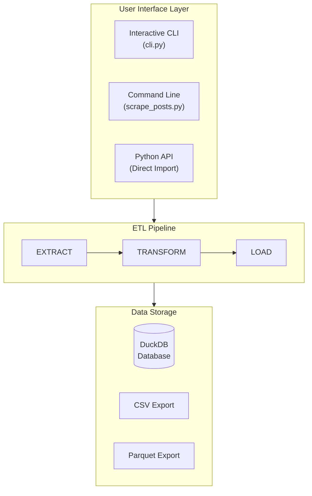
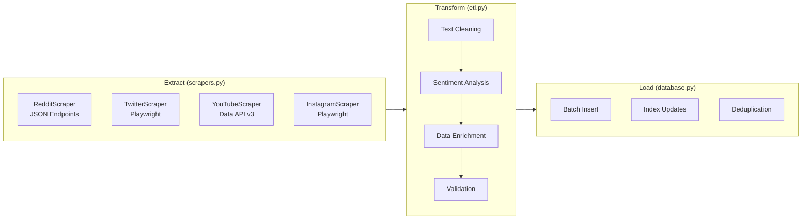
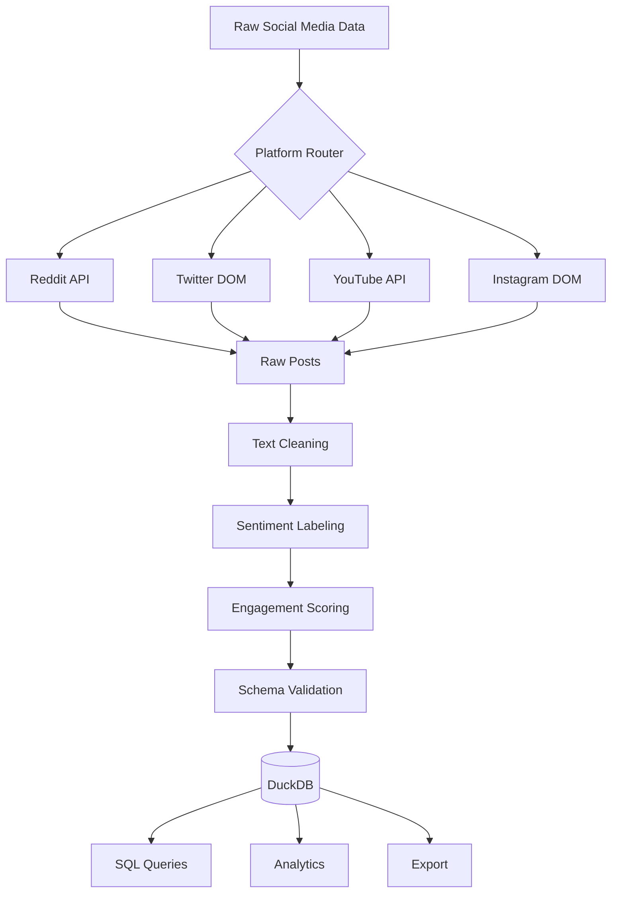

# Social Media ETL Pipeline

A production-grade Python framework for extracting, transforming, and loading social media data from multiple platforms. Built for researchers, data scientists, and developers who need structured datasets for sentiment analysis, behavioral modeling, and NLP applications.

---

## Table of Contents

- [Overview](#overview)
- [Key Features](#key-features)
- [Supported Platforms](#supported-platforms)
- [System Requirements](#system-requirements)
- [Installation](#installation)
- [Configuration](#configuration)
- [Usage Guide](#usage-guide)
  - [Interactive Mode](#interactive-mode)
  - [Command Line Interface](#command-line-interface)
  - [Programmatic Access](#programmatic-access)
- [Database Operations](#database-operations)
- [ETL Pipeline](#etl-pipeline)
- [Data Schema](#data-schema)
- [Architecture](#architecture)
- [Performance](#performance)
- [Troubleshooting](#troubleshooting)
- [License](#license)

---

## Overview

This ETL pipeline automates the collection and processing of social media content. It extracts posts from Reddit, Twitter/X, YouTube, and Instagram, transforms them with text cleaning and sentiment analysis, and loads them into a high-performance DuckDB database for instant querying.

All scraping methods are free and do not require paid API subscriptions.

---

## Key Features

| Feature | Description |
|---------|-------------|
| Multi-Platform Support | Reddit, Twitter/X, YouTube, Instagram |
| DuckDB Database | Microsecond query response times |
| Sentiment Analysis | Automatic positive/negative/neutral classification |
| Interactive CLI | Menu-driven terminal interface |
| ETL Pipeline | Text cleaning, enrichment, and validation |
| Export Options | CSV and Parquet format support |
| Rate Limiting | Built-in protection against API bans |

---

## Supported Platforms

| Platform | Method | Cost | Authentication |
|----------|--------|------|----------------|
| Reddit | JSON endpoints | Free | None required |
| Twitter/X | Browser automation | Free | Optional |
| YouTube | Data API v3 | Free (10K units/day) | API key |
| Instagram | Browser automation | Free | Login required |

---

## System Requirements

- Python 3.10 or higher
- 4GB RAM minimum (8GB recommended for large datasets)
- Linux, macOS, or Windows
- Chromium browser (installed automatically via Playwright)

---

## Installation

### Step 1: Clone the Repository

```bash
git clone https://github.com/yourusername/Social-Media-ETL-Pipeline.git
cd Social-Media-ETL-Pipeline
```

### Step 2: Create Virtual Environment

```bash
python3 -m venv venv
source venv/bin/activate    # Linux/macOS
# venv\Scripts\activate     # Windows
```

### Step 3: Install Dependencies

```bash
pip install -r requirements.txt
```

### Step 4: Install Browser for Playwright

```bash
playwright install chromium
```

### Step 5: Configure Credentials

```bash
cp config.example.json config.json
# Edit config.json with your credentials
```

---

## Configuration

Edit `config.json` to add your platform credentials:

```json
{
    "youtube_api_key": "YOUR_API_KEY",
    "instagram": {
        "username": "YOUR_USERNAME",
        "password": "YOUR_PASSWORD"
    },
    "twitter": {
        "username": "YOUR_USERNAME",
        "password": "YOUR_PASSWORD"
    },
    "reddit": {
        "user_agent": "SocialMediaETL/1.0 (research project)"
    }
}
```

### Obtaining API Keys

**YouTube Data API:**
1. Navigate to [Google Cloud Console](https://console.cloud.google.com/)
2. Create a new project
3. Enable "YouTube Data API v3"
4. Navigate to Credentials and create an API Key
5. Copy the key to `config.json`

**Reddit:** No API key required. The scraper uses public JSON endpoints.

**Twitter/X:** Credentials are optional. The scraper works without login but may have limited access.

**Instagram:** Requires valid account credentials for login.

---

## Usage Guide

### Interactive Mode

Launch the interactive command-line interface:

```bash
python cli.py
```

The interactive mode provides:
- Platform selection menu
- Guided input prompts
- Real-time progress indicators
- SQL query interface
- Analytics dashboard
- Data export options

### Command Line Interface

For scripting and automation, use the traditional CLI:

```bash
# Reddit - Subreddit scraping
python scrape_posts.py --platform reddit --subreddit MachineLearning --limit 100

# Reddit - Search
python scrape_posts.py --platform reddit --target "sentiment analysis" --limit 50

# Reddit - With sort order
python scrape_posts.py --platform reddit --subreddit python --sort new --limit 50

# Twitter/X
python scrape_posts.py --platform twitter --target "artificial intelligence" --limit 50

# YouTube
python scrape_posts.py --platform youtube --target "machine learning tutorial" --limit 25

# Instagram
python scrape_posts.py --platform instagram --target photography --limit 25

# Custom output file
python scrape_posts.py --platform reddit --subreddit datascience --output reddit_data.csv
```

#### CLI Arguments

| Argument | Description | Required |
|----------|-------------|----------|
| `--platform` | Target platform (reddit, twitter, youtube, instagram) | Yes |
| `--target` | Search query or hashtag | Conditional |
| `--subreddit` | Reddit subreddit name (without r/) | Conditional |
| `--limit` | Maximum posts to retrieve (default: 50) | No |
| `--sort` | Reddit sort order: hot, new, top, rising | No |
| `--output` | Output CSV filename | No |

### Programmatic Access

Import the scrapers directly in your Python code:

```python
from scrapers import RedditScraper, TwitterScraper, YouTubeScraper
from database import Database
from etl import ETLPipeline

# Extract data from Reddit
scraper = RedditScraper()
posts = scraper.search_subreddit("datascience", sort="hot", limit=100)

# Process through ETL pipeline
db = Database()
pipeline = ETLPipeline(db)
results = pipeline.run(posts)

print(f"Processed {results['loaded_count']} posts")
print(f"Sentiment distribution: {results['transform_stats']['sentiment']}")

# Query the database
recent = db.get_posts(platform="reddit", limit=10)
for post in recent:
    print(f"{post['author']}: {post['post_text'][:50]}...")

db.close()
```

---

## Database Operations

The pipeline uses DuckDB, an embedded analytical database optimized for fast queries.

### Basic Queries

```python
from database import Database

db = Database()

# Retrieve posts with filtering
posts = db.get_posts(platform="twitter", limit=100)

# Full-text search
results = db.search("machine learning", limit=50)

# Custom SQL queries
results = db.query("""
    SELECT author, COUNT(*) as post_count, AVG(likes) as avg_likes
    FROM posts
    WHERE platform = 'reddit'
    GROUP BY author
    ORDER BY post_count DESC
    LIMIT 10
""")

# Get database statistics
stats = db.get_stats()
print(f"Total posts: {stats['total_posts']}")
print(f"By platform: {stats['by_platform']}")
```

### Analytics

```python
# Sentiment distribution
sentiment = db.get_sentiment_distribution()
for row in sentiment:
    print(f"{row['sentiment_label']}: {row['count']} ({row['percentage']}%)")

# Top hashtags
hashtags = db.get_top_hashtags(limit=20)
for tag in hashtags:
    print(f"#{tag['hashtag']}: {tag['count']}")
```

### Export

```python
# Export to CSV
db.export_csv("export.csv", platform="reddit")

# Export to Parquet (compressed, fast to reload)
db.export_parquet("export.parquet")
```

---

## ETL Pipeline

The pipeline consists of three stages:

### Extract

Scrapers collect raw data from each platform:
- `RedditScraper`: Uses public JSON endpoints
- `TwitterScraper`: Browser automation via Playwright
- `YouTubeScraper`: Official Data API v3
- `InstagramScraper`: Browser automation via Playwright

### Transform

The `Transformer` class processes raw data:
- Text cleaning and normalization
- HTML entity decoding
- Sentiment analysis (lexicon-based)
- Engagement level classification
- Metadata extraction (word count, mention count, URLs)

### Load

The `Loader` class inserts data into DuckDB:
- Batch insertion for performance
- Duplicate detection via unique constraints
- Automatic timestamp tracking

```python
from etl import Transformer, Loader
from database import Database

# Transform raw posts
transformer = Transformer()
transformed = transformer.transform(raw_posts)

# Load into database
db = Database()
loader = Loader(db)
loaded_count = loader.load(transformed)
```

---

## Data Schema

All platforms output data in a consistent schema:

| Field | Type | Description |
|-------|------|-------------|
| `id` | INTEGER | Auto-increment primary key |
| `post_id` | VARCHAR | Platform-specific unique identifier |
| `platform` | VARCHAR | Source platform name |
| `post_text` | TEXT | Cleaned post content |
| `hashtags` | VARCHAR | Comma-separated tags |
| `timestamp` | TIMESTAMP | Original post time |
| `image_url` | VARCHAR | Media thumbnail URL |
| `likes` | INTEGER | Like/upvote count |
| `comments` | INTEGER | Comment/reply count |
| `author` | VARCHAR | Username |
| `url` | VARCHAR | Direct link to post |
| `scraped_at` | TIMESTAMP | Collection timestamp |

### Platform-Specific Fields

| Field | Platform | Description |
|-------|----------|-------------|
| `subreddit` | Reddit | Subreddit name |
| `upvote_ratio` | Reddit | Upvote percentage |
| `retweet_count` | Twitter | Retweet count |
| `view_count` | YouTube | Video views |
| `duration` | YouTube | Video length |
| `channel_id` | YouTube | Channel identifier |

### ETL-Added Fields

| Field | Description |
|-------|-------------|
| `sentiment_label` | positive, negative, or neutral |
| `engagement_level` | low, medium, high, or viral |
| `processed_at` | ETL processing timestamp |

---

## Architecture

### System Overview



### ETL Pipeline Detail



### Data Flow



### Component Responsibilities

| Component | File | Responsibility |
|-----------|------|----------------|
| Interface | `cli.py` | Interactive menu, prompts, display |
| Interface | `scrape_posts.py` | Command-line argument parsing |
| Extract | `scrapers.py` | Platform-specific data retrieval |
| Transform | `etl.py` | Data cleaning, sentiment, enrichment |
| Load | `database.py` | DuckDB operations, queries, export |
| Utilities | `utils.py` | Rate limiting, text processing |


---

## Performance

| Operation | Typical Time |
|-----------|--------------|
| Query 1,000 posts | < 5 ms |
| Full-text search | < 10 ms |
| Aggregate statistics | < 2 ms |
| Insert 100 posts | < 50 ms |
| Export to Parquet | < 100 ms |

DuckDB provides these speeds through:
- Columnar storage format
- Vectorized query execution
- In-process execution (no network overhead)

---

## Project Structure

```
Social-Media-ETL-Pipeline/
├── cli.py                  # Interactive command-line interface
├── scrape_posts.py         # Traditional CLI for scripting
├── scrapers.py             # Platform scraper classes
├── database.py             # DuckDB database layer
├── etl.py                  # Transform and Load pipeline
├── utils.py                # Rate limiting, text processing
├── config.json             # Credentials (not committed)
├── config.example.json     # Template configuration
├── requirements.txt        # Python dependencies
├── .gitignore              # Git ignore rules
├── social_media.duckdb     # Database file (generated)
└── thumbnails/             # Downloaded media (generated)
```

---

## Troubleshooting

### Common Issues

**ModuleNotFoundError: No module named 'duckdb'**
```bash
pip install duckdb
```

**Playwright browser not found**
```bash
playwright install chromium
```

**No posts returned from scraper**
- Verify credentials in `config.json`
- Check network connectivity
- Twitter/Instagram may require CAPTCHA verification on first login

**Rate limit errors**
- The scrapers include built-in rate limiting
- For Reddit, requests are spaced 2 seconds apart
- Wait a few minutes before retrying if rate limited

**Database locked error**
- Ensure only one process accesses the database at a time
- Close any open database connections before running new queries

### Logging

Enable debug logging for detailed output:

```python
import logging
logging.basicConfig(level=logging.DEBUG)
```

---

## Dependencies

| Package | Purpose |
|---------|---------|
| pandas | Data manipulation |
| requests | HTTP client |
| tqdm | Progress indicators |
| playwright | Browser automation |
| google-api-python-client | YouTube API |
| rich | Terminal UI |
| duckdb | Embedded database |
| tenacity | Retry logic |
| aiohttp | Async HTTP |

---

## License

This project is licensed under the MIT License. See the LICENSE file for details.

---

## Contributing

Contributions are welcome. Please submit pull requests with:
- Clear commit messages
- Updated documentation
- Tests for new functionality

---

## Disclaimer

This tool is intended for research and educational purposes. Users are responsible for ensuring their use complies with the terms of service of each platform and applicable laws regarding data collection and privacy.
